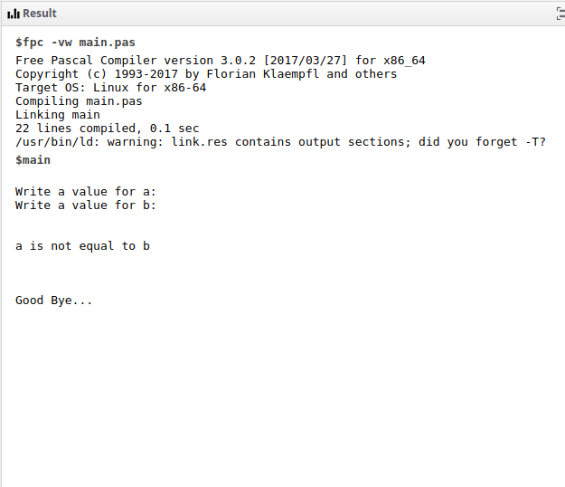

# My First Program

This is a simple if/else program I had made in my beginning, made with [Pascal](https://en.wikipedia.org/wiki/Pascal_(programming_language)).

## How to run .pas files

* You can use the [fpc compiler](https://www.freepascal.org/);

* Or, the easier way, you can use a Pascal Online Compiler,
such as [the tutorialspoint online compiler](https://www.tutorialspoint.com/compile_pascal_online.php):

1- Put the [first-program.pas](./first-program.pas) file content into the code area:

2- Add some STDIN values to the variable `a` and `b`. For example: `1` and `2`, respectively:

3- And then, hit the `Execute` button and you'll see the output aside:

